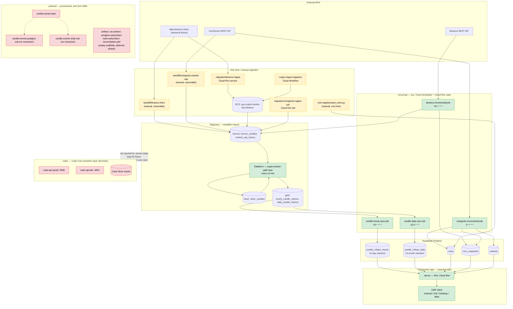

# cryptotracker-data-platform

Backend data platform for the crypto tracker: ingestion, storage, and the
analytics layer. This is a separate repo from the client-facing app repo
(Compose Multiplatform app + its Ktor `:server` module). The two repos share
*conventions* (env-var driven config, model shapes) but no code — `common/`
here is deliberately a standalone module, not a shared dependency across
repos. `:server` reads two Postgres tables this platform keeps fresh
(`candle_rollups_hourly`/`candle_rollups_daily`, see Phase 8 below); it does
not otherwise touch this repo or its GCP project.

## How it's wired up, end to end

Two generations of ingestion feed this pipeline (see the callouts below),
converging through BigQuery's medallion layers into the Postgres tables
`:server` reads. The color-coded diagram below shows the full path — live
vs. manual vs. dormant components — and also lives on its own in
[`architecture-diagram.mmd`](architecture-diagram.mmd) —
**[open it preloaded in the Mermaid Live Editor](https://mermaid.live/edit#pako:eNqNWAtPHDcQ_ivWRVEh3eWOBJTo1EZKIKJpVYUCUtTmKuT1zt25eO2N7YVcHv-949e-7kggUrDn8XlmPJ6Z5cuEqRImczJ5_Jic6E1t1ZWm7AY0OaWWknNB7VLpiiyap7PDIwKyzK3K8Rehmq25BWYbDQuJ6ufUWCB2zQ1ZcgE_GcKUtCCtIVxaRdbW1mY-nVagK8rLA8FvUVwRjWh4HrcHHuZMA0jyK3HsqWFrKBsBZUb-BiHUHTKUhNzyCqYVlQ0VGbmAEsm1VrfccOSWpGgsKdFsKu20hCVoDeVCLuQSEdiaakuuXi8kwR_TFCtN6zWBT_bDYvLmkwUtqSCvzt-axeTfIOR-Ci6pZIB0FHsdNuTizeWVE90l-Rs3DrHEMB5E0kEwkOxhjKzSnOFBN4JLMPsDhBWwGxVOOlFcnrnt9lkYNufTwAv03oUGFd_FKJEpCXHCS1iBsXj-4KySa7xDZ1UKifup-Cr6iFC40dSJTKMfeYD6pdDTlydCNSW5aCQxoG85gwE6qnrrByhMOX2kRpz8P1WMsJAyxnmv9I27P4RiPlGTdgvcw0jCw7Ay87rB3LYf9haTs5PLOVLqPILZkPa5pnd5dHMx2e9fK_Ixr0UXl0Rpw6LWgt16K_ZSbmowTUULAcMbTqopOC1UF5uKajQ1Z7R-EKIBKH9XhYsOQuQaVphjejN19GtHMgf1ZoiUHtL-d1MK06PRGq1C6HY9TQXBvdKMhKBfxseqyc-ku0o0yjwg42IM30qmXTzaRGMaKqwhVLRZ8mR6TJ6Ef9uvJur3U2wbYbZTf60aLTaXG8kcAJWlgDzQcoPEH55fUj5W96Sh9uExmY2Ud0W9-OjLzOqvBvQmBbuCkgrhIifoRjX2IWHVSn4Gl_BhNY-U62ChyUjIM9zX16EsbYZ57wqYawFoz2lcJntGT2elRInpUivvKNw6y9Hdig8rjuECWc6ksJpHSjJpeLwDdbLu9zzeUZS8rsBiEUUffJxH1A5mV3xrl86XTU0LaoCcK2NXGh6Sp_4pXTmL_GporJG0NmtlO4HrljSUDFEPcnE9FAieXighmtqDBee0J5jrwA4ZNcM822DgXa_15X1_nJX3wnhuQHmWV9iu17twdgWQNQWcaYWoCIrrtiKc4IacKA1YklwD5sxlKxaFvdiR9x8SZQQ516qM4DmtOdnDDl_uk_nRbDYbQDiJU7jtyeYl3HrBwy3BS8xw_x68nX5HmGhwdNE_yJimwHVyOexap3vDR0Y-g1YkTDeaLpecPcBhq2reKxz4eNzc5KnDx9MUKVnH0nkdGU6I7Enl5i_sFaD3xxA4MfFtfe2oP1BO0xQqU65di51m5M7kd9hwQeM6GZEjjmGaF47qM8zDD8iutyjJuOC-f7saOQ0tCqrabohhGD589-6Fx3NJvcYH-_2ORevaT05VTaWLM-7TPRmoKQ4L4MvUA67FzTTgGso8rBLOH5g3WdfkhlkmOIbTWfDnedx4p17JUite4kDG313i_6dgbvCCcfUeil0O9QZJkucvxxNIoPlqHuTT2DgQDsPjWHQM3c17fttOSkG6N33tYrfbrWPS-DdgDCxoze3a_w5n2tY-0nak-3xreV1R7iG33FDPd3G-r5cKeJt9Yf4aYEZ7vG2ekXppwPddL2r79UAmMAYargcmVN9sHbEbW3rbUPBHku2A0u2SXLT0I8kP8pdfpbLkIw4e3H1KbUjKfauwz_hUvoHaEjSLLBv3-UcofjJtsNKbKX5d2QLVG-yqDF_q165RpFN8UfMH9avZLp4vU0mt71iIn7cqhYnfywu3sUXurneLle52WycEwt-xf9jJOCaoMaewDGXfvbv5o_IIypJmOIWrG5g_evqCPj86zpgSSs8fuR421IxfaUF3uVw-Y2Wru1yyw9nz-3VjZ03KL8rnvYNL9ux4dHBPvf9csjbFsy6rsjZtspSMWYhDFmLgfe4jdsUkSwUg65WQbFTHskGpytJDCvHo46ahIIsNP2v7eebzJuulU5bSJ2s7RwzSQk4yMol_hHB_-fjizlhM7Bo_E7DQ4xJVaCNwvF7Ib064qdFzOOUU-0uFElY3-NEzwaRerXG7pMK4Pbabf5TqCay0P8Htvv0PDJTDeA)**
to explore it interactively (pan/zoom, no setup needed). If you edit the
`.mmd` file, paste its new contents into that editor to get an updated link,
and update the copy embedded below to match.



Two things worth calling out explicitly since they're easy to miss reading
the directory names alone:

- **There are two generations of ingestion**: `migration/` and `backfill/`
  are one-time/manually-triggered (historical data only, never on a
  schedule); `recurring/` is the actual live, continuously-scheduled path
  that keeps everything current. Don't confuse `migration/`'s
  `crypto-ingest-migration` Workflow with ongoing orchestration — it exists
  for re-running the historical load if ever needed, not for daily
  operation.
- **Pub/Sub (`pubsub/`) is fully provisioned but has never carried real
  traffic.** The live price-writing job (`binance-incremental-job`) writes
  directly to BigQuery/Postgres and bypasses Pub/Sub entirely. `pubsub/`'s
  own README is explicit that this is intentional groundwork for a later,
  not-yet-built real-time phase — see that README before assuming data
  flows through it.

## Phase index

| Phase | Directory | Status |
|---|---|---|
| 2 | `coin-registry/` — Postgres schema + coin/binance_symbol seed job | **implemented, live** |
| 3 | `backfill/` — one-time historical backfill (Binance OHLCV, CoinGecko market cap) | **implemented** — run manually, not scheduled |
| 3 | `migration/` — one-time/manual historical ingestion via Cloud Run + a Cloud Workflow, staged through GCS into `bronze` | **implemented, deployed** — `binance-ingest` (Cloud Run service), `coingecko-ingest-job` (Cloud Run job), `crypto-ingest-migration` (Workflow); run manually, not scheduled |
| 4 | `recurring/` — scheduled incremental ETL keeping `bronze`/Postgres current | **implemented, live** — see below |
| 4 | `pubsub/` — GCP Pub/Sub topic/subscription provisioning | **implemented, deployed** — provisioned and monitored, but zero producers exist yet (see `pubsub/README.md`) |
| 5 | `dataform/` — `silver`/`gold` BigQuery transforms | **implemented, live** — scheduled every 15 min |
| 5 | `ws-worker/`, `reconciliation-job/`, `common/` — Binance WS → Pub/Sub | scaffold only, deferred |
| 6 | `postgres-subscriber/`, `redis-subscriber/` — Pub/Sub consumers | scaffold only, deferred |
| 7 | `cube/` — BigQuery semantic layer (Cube Core + Cube Store) | **implemented, deployed** (home server) — not currently queried by anything; kept for a future analytics/chatbot use case |
| 8 | `coin-registry/migrations/0003_candle_rollups.sql` + `recurring/candle-hourly-sync`, `recurring/candle-daily-sync` — Lambda-architecture rollup tables serving the app's `:server` backend | **implemented, live** |
| 9 | `airflow/` — orchestration DAGs | scaffold only, deferred |
| 10 | ~~`infra/`~~ | removed — its premise (a combined docker-compose for Cube + the app's old `:server` container, both on this same home server) is moot now that `:server` runs on Cloud Run instead |

`bigquery/` and `pubsub-infra/` (both empty placeholders from the original
plan) have also been removed — `bigquery`'s warehouse objects ended up
managed by `dataform/` instead of hand-written DDL, and `pubsub-infra` was
superseded by a rename to `pubsub/`, which has the actual provisioning
script.

Directories for unimplemented phases exist as placeholders per the intended
repo layout; they contain no working code yet, but per `pubsub/README.md`
they're deliberately deferred, not abandoned — the provisioned Pub/Sub
topic/subscriptions they'd eventually produce into/consume from already
exist and are monitored.

## Phase 2 — coin-registry

See [`coin-registry/README.md`](coin-registry/README.md) for schema details,
setup, and how to run the migrations and seed job.

Quick start:

```bash
cd coin-registry
python3 -m venv .venv && source .venv/bin/activate
pip install -r requirements.txt
cp .env.example .env   # fill in DATABASE_URL and (optionally) COINGECKO_API_KEY
python3 migrations/run_migrations.py
python3 src/seed_coins.py --top-n 150
```

## The live, scheduled pipeline

Everything below runs continuously in GCP project `gcp-crypto-tracker`
(`us-central1`), no manual intervention required:

| Component | Trigger | Does |
|---|---|---|
| `binance-incremental-job` | Cloud Scheduler, `*/5 * * * *` | Appends new candles to `bronze.bronze_candles`; writes live price to Postgres `coin_snapshots` for Binance-tradeable coins |
| `coingecko-incremental-job` | Cloud Scheduler, `0 * * * *` | Refreshes Postgres `coins`/`coin_snapshots`/`markets`; sole price source for coins with no Binance USDT pair |
| Dataform (`crypto-tracker-gold` repo, `gold-rollups-schedule` workflow config) | Dataform-native schedule, `*/15 * * * *` | Rebuilds `gold.hourly_candle_metrics`/`gold.daily_candle_metrics` from `silver.silver_candles` |
| `candle-hourly-sync-job` | Cloud Scheduler, `*/5 * * * *` | Syncs `gold.hourly_candle_metrics` → Postgres `candle_rollups_hourly` |
| `candle-daily-sync-job` | Cloud Scheduler, `15 0 * * *` | Syncs `gold.daily_candle_metrics` → Postgres `candle_rollups_daily` |

See [`recurring/README.md`](recurring/README.md) for full detail on all four
Cloud Run Jobs (service accounts, deploy commands, verification queries).

## Kotlin modules (future phases)

`settings.gradle.kts` / `build.gradle.kts` / `gradle/libs.versions.toml` are in
place with shared plugin versions and a version catalog (Ktor, kotlinx.serialization,
GCP Pub/Sub client, Postgres driver, Jedis), but no modules are registered yet —
every phase implemented so far is plain Python (`coin-registry`, `backfill/`,
`recurring/`) or Kotlin built standalone under `migration/` (not wired into
this root Gradle build). Modules get uncommented in `settings.gradle.kts` as
each deferred phase (`ws-worker`, `reconciliation-job`, `postgres-subscriber`,
`redis-subscriber`, `common`) actually adds code.
