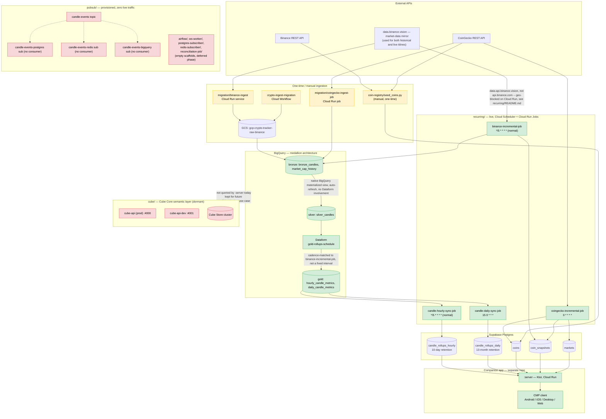

# cryptotracker-data-platform

Backend data platform for the crypto tracker: ingestion, storage, and the
analytics layer. This is a separate repo from the client-facing app repo
(Compose Multiplatform app + its Ktor `:server` module). The two repos share
*conventions* (env-var driven config, model shapes) but no code — `common/`
here is deliberately a standalone module, not a shared dependency across
repos. `:server` reads two Postgres tables this platform keeps fresh
(`candle_rollups_hourly`/`candle_rollups_daily`, see Phase 8 below); it does
not otherwise touch this repo or its GCP project.

## How it's wired up, end to end

Two generations of ingestion feed this pipeline (see the callouts below),
converging through BigQuery's medallion layers into the Postgres tables
`:server` reads. The color-coded diagram below (live vs. manual vs. dormant
components) renders natively here on GitHub. Schedule labels below show the
**designed/normal** cadence, not necessarily today's actual value — three
of them (`binance-incremental-job`, the Dataform gold rebuild,
`candle-hourly-sync-job`) are currently throttled/cadence-coupled to stay
under GCP free tiers; check `HANDOFF.md` for the live values, which change
independently of this diagram.



Two things worth calling out explicitly since they're easy to miss reading
the directory names alone:

- **`migration/` is one-time/manually-triggered** (historical data only,
  never on a schedule); `recurring/` is the actual live, continuously-
  scheduled path that keeps everything current. Don't confuse `migration/`'s
  `crypto-ingest-migration` Workflow with ongoing orchestration — it exists
  for re-running the historical load if ever needed, not for daily
  operation. (An earlier local-only backfill approach was fully replaced by
  `migration/` and removed.)
- **Pub/Sub (`pubsub/`) is fully provisioned but has never carried real
  traffic.** The live price-writing job (`binance-incremental-job`) writes
  directly to BigQuery/Postgres and bypasses Pub/Sub entirely. `pubsub/`'s
  own README is explicit that this is intentional groundwork for a later,
  not-yet-built real-time phase — see that README before assuming data
  flows through it.

## Phase index

| Phase | Directory | Status |
|---|---|---|
| 2 | `coin-registry/` — Postgres schema + coin/binance_symbol seed job | **implemented, live** |
| 3 | `migration/` — one-time/manual historical ingestion via Cloud Run + a Cloud Workflow, staged through GCS into `bronze` | **implemented, deployed** — `binance-ingest` (Cloud Run service), `coingecko-ingest-job` (Cloud Run job), `crypto-ingest-migration` (Workflow); run manually, not scheduled |
| 4 | `recurring/` — scheduled incremental ETL keeping `bronze`/Postgres current | **implemented, live** — see below |
| 4 | `pubsub/` — GCP Pub/Sub topic/subscription provisioning | **implemented, deployed** — provisioned and monitored, but zero producers exist yet (see `pubsub/README.md`) |
| 5 | `dataform/` — `silver`/`gold` BigQuery transforms | **implemented, live** — cadence-matched to `binance-incremental-job`'s ingestion frequency rather than a fixed interval (see `HANDOFF.md` for the live value, `recurring/README.md` for why: BigQuery's 1 TiB/month on-demand query free tier) |
| 5 | `ws-worker/`, `reconciliation-job/`, `common/` — Binance WS → Pub/Sub | scaffold only, deferred |
| 6 | `postgres-subscriber/`, `redis-subscriber/` — Pub/Sub consumers | scaffold only, deferred |
| 7 | `cube/` — BigQuery semantic layer (Cube Core + Cube Store) | **implemented, deployed** (home server) — not currently queried by anything; kept for a future analytics/chatbot use case |
| 8 | `coin-registry/migrations/0003_candle_rollups.sql` + `recurring/candle-hourly-sync`, `recurring/candle-daily-sync` — Lambda-architecture rollup tables serving the app's `:server` backend | **implemented, live** |
| 9 | `airflow/` — orchestration DAGs | scaffold only, deferred |
| 10 | ~~`infra/`~~ | removed — its premise (a combined docker-compose for Cube + the app's old `:server` container, both on this same home server) is moot now that `:server` runs on Cloud Run instead |

`bigquery/` and `pubsub-infra/` (both empty placeholders from the original
plan) have also been removed — `bigquery`'s warehouse objects ended up
managed by `dataform/` instead of hand-written DDL, and `pubsub-infra` was
superseded by a rename to `pubsub/`, which has the actual provisioning
script.

Directories for unimplemented phases exist as placeholders per the intended
repo layout; they contain no working code yet, but per `pubsub/README.md`
they're deliberately deferred, not abandoned — the provisioned Pub/Sub
topic/subscriptions they'd eventually produce into/consume from already
exist and are monitored.

## Phase 2 — coin-registry

See [`coin-registry/README.md`](coin-registry/README.md) for schema details,
setup, and how to run the migrations and seed job.

Quick start:

```bash
cd coin-registry
python3 -m venv .venv && source .venv/bin/activate
pip install -r requirements.txt
cp .env.example .env   # fill in DATABASE_URL and (optionally) COINGECKO_API_KEY
python3 migrations/run_migrations.py
python3 src/seed_coins.py --top-n 150
```

## The live, scheduled pipeline

Everything below runs continuously in GCP project `gcp-crypto-tracker`
(`us-central1`), no manual intervention required. **Temporary exception**:
`binance-incremental-job` is throttled to every 3h as of 2026-07-20 to stay
under the Cloud Run Jobs free tier, and Dataform's gold-layer rebuild +
`candle-hourly-sync-job` are now cadence-matched/offset to it rather than
running independently -- see `recurring/README.md` for the why/math and the
revert-all-three-together command. The schedules below are the
normal/designed state (ingestion every 5 min, not throttled to 3h).

| Component | Trigger | Does |
|---|---|---|
| `binance-incremental-job` | Cloud Scheduler, `*/5 * * * *` | Appends new candles to `bronze.bronze_candles`; writes live price to Postgres `coin_snapshots` for Binance-tradeable coins |
| `coingecko-incremental-job` | Cloud Scheduler, `0 * * * *` | Refreshes Postgres `coins`/`coin_snapshots`/`markets`; sole price source for coins with no Binance USDT pair |
| Dataform (`crypto-tracker-gold` repo, `gold-rollups-schedule` workflow config) | Dataform-native schedule, cadence-matched to `binance-incremental-job` (see `HANDOFF.md` for the live value) | Rebuilds `gold.hourly_candle_metrics`/`gold.daily_candle_metrics` from `silver.silver_candles` |
| `candle-hourly-sync-job` | Cloud Scheduler, `*/5 * * * *` | Syncs `gold.hourly_candle_metrics` → Postgres `candle_rollups_hourly` |
| `candle-daily-sync-job` | Cloud Scheduler, `15 0 * * *` | Syncs `gold.daily_candle_metrics` → Postgres `candle_rollups_daily` |

See [`recurring/README.md`](recurring/README.md) for full detail on all four
Cloud Run Jobs (service accounts, deploy commands, verification queries).

## Kotlin modules (future phases)

`settings.gradle.kts` / `build.gradle.kts` / `gradle/libs.versions.toml` are in
place with shared plugin versions and a version catalog (Ktor, kotlinx.serialization,
GCP Pub/Sub client, Postgres driver, Jedis), but no modules are registered yet —
every phase implemented so far is plain Python (`coin-registry`,
`recurring/`) or Kotlin built standalone under `migration/` (not wired into
this root Gradle build). Modules get uncommented in `settings.gradle.kts` as
each deferred phase (`ws-worker`, `reconciliation-job`, `postgres-subscriber`,
`redis-subscriber`, `common`) actually adds code.
